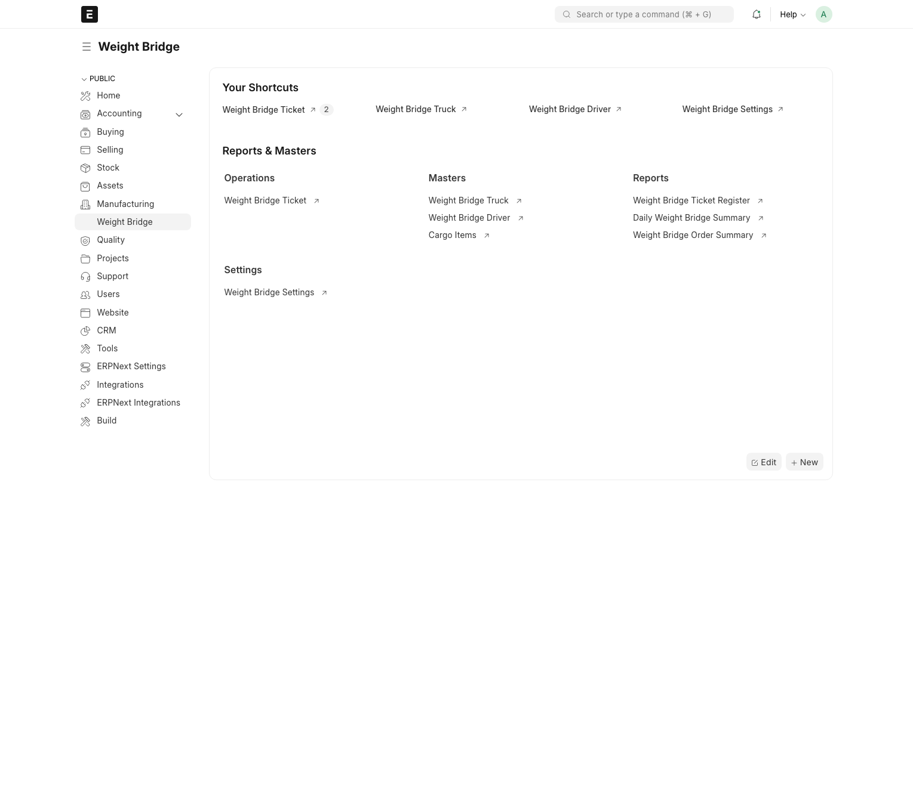

# Weight Bridge

Weight Bridge is a Frappe/ERPNext v15 app for recording truck weighbridge tickets.
It supports one form for incoming and outgoing cargo movements and calculates the
ticket direction from first and second weight values.



## Features

- Ticket DocType: `Weight Bridge Ticket`
- Truck master DocType: `Weight Bridge Truck`, named by plate number
- Driver master DocType: `Weight Bridge Driver`, named by phone number
- Public Desk workspace: `Weight Bridge`, placed after Manufacturing
- Settings singleton: `Weight Bridge Settings`
- Reports: `Weight Bridge Ticket Register`, `Daily Weight Bridge Summary`, and `Weight Bridge Order Summary`
- Ticket plate number is selected from saved trucks
- Ticket driver phone number fetches driver name, passport number, and national code as read-only details
- Client-side Web Serial scale reading from Chrome/Edge, with no custom API or service layer
- Provisional IDs such as `WB-260506-01` on first weighing
- Final IDs such as `IN-260506-01` or `OUT-260506-01` after second weighing
- Direction, gross weight, vehicle/tare weight, and net weight calculated server-side
- Cargo linked to ERPNext `Item`
- Inbound tickets can link to an active submitted ERPNext `Purchase Order`
- Outbound tickets can link to an active submitted ERPNext `Sales Order`
- Origin and destination linked dynamically to `Supplier`, `Customer`, or `Warehouse`
- Install seed data for `VR`, `Bitumen 40/50`, and `Bitumen 60/70`
- Browser-side scale capture from a stable serial reading; no backend scale API or service is required

## Local Bench Installation

```bash
cd $PATH_TO_YOUR_BENCH
bench get-app https://github.com/Botanium/weight_bridge --branch version-15
bench --site $SITE_NAME install-app weight_bridge
bench --site $SITE_NAME migrate
```

## Frappe Cloud Installation

Use a Frappe Cloud bench group on version 15. Add this app repository and select
the `version-15` branch. The app declares its Frappe compatibility in
`pyproject.toml`:

```toml
[tool.bench.frappe-dependencies]
frappe = ">=15.0.0,<16.0.0"
```

After validation, deploy the bench group and install `weight_bridge` on the test
site before deploying to production.

## Local Docker Stack Used During Development

This repository was tested against the local Docker stack:

- Frappe `15.73.0`
- ERPNext `15.67.0`
- Site name `frontend`
- Local URL `http://localhost:8080`

The local Docker image and compose override are kept outside the app repository
because they are machine-specific.

## Truck and Driver Masters

Create truck records in `Weight Bridge Truck` before using them on tickets. For
v1, each truck only stores `Plate Number`.

Create driver records in `Weight Bridge Driver`. The driver's phone number is the
document ID. When the phone number is selected on a ticket, the ticket fetches
the driver's name, passport number, and national code into read-only fields. The
selected driver link itself is the phone number, so the ticket does not show a
second duplicate phone field.

## Workspace, Settings, and Reports

The app adds a public `Weight Bridge` workspace in Desk. It links the ticket,
truck, driver, settings, cargo items, and the standard reports needed for daily
operations.

`Weight Bridge Settings` controls basic validation rules:

- Minimum first, second, and net weights
- Optional maximum gross and net weights
- Whether the second weighing must happen after the first weighing
- Whether the browser should reconnect to an already authorized scale serial port
- Serial baud rate, stable status codes, stable reading count, and weight tolerance
- Whether IN tickets require a Purchase Order
- Whether OUT tickets require a Sales Order

The built-in reports cover detailed ticket history, daily totals by cargo and
direction, and truck totals grouped by Purchase Order or Sales Order.

## Client-Side Serial Scale Reading

`Weight Bridge Ticket` adds `Connect Scale` / `Disconnect Scale` actions in the
form toolbar and shows the scale connection state in the form headline. The
weighing fields are read-only. When the scale emits the configured number of
stable readings, the ticket captures the next required weight and the current
date/time automatically.

This uses the browser Web Serial API only. The app does not create a local
service, backend API, socket bridge, or server-side serial reader. The serial
device must be connected to the same computer that is running the browser.

Browser requirements:

- Chrome or Edge with Web Serial support
- HTTPS on hosted sites, such as Frappe Cloud
- `localhost` is supported for local Docker testing

The first time an operator uses a computer, the browser requires an explicit
`Connect Scale` click so the operator can choose the serial port, for example
COM3. After that permission exists, the app can reconnect automatically when a
ticket form opens.

The default port settings are `9600` baud, `8` data bits, `1` stop bit, no
parity, and no flow control. The baud rate and stable-reading rules are managed
from `Weight Bridge Settings`.

## Ticket Logic

When only the first weight is entered, the ticket remains `Pending Second Weight`
and receives a provisional `WB-YYMMDD-##` ID.

The second weight is captured only after the first weighing has been saved as a
provisional `WB-...` ticket, which prevents the same parked truck reading from
filling both weighing fields in one session.

When the second weight is entered:

- If `first_weight > second_weight`, direction is `IN`
- If `second_weight > first_weight`, direction is `OUT`
- Gross weight is the larger weight
- Vehicle/tare weight is the smaller weight
- Net weight is the difference
- Equal weights are rejected

For inbound tickets, only the `Purchase Order` field is shown. The dropdown is
filtered to submitted orders that are not closed or cancelled, and when the
origin is a Supplier it filters by that supplier.

For outbound tickets, only the `Sales Order` field is shown. The dropdown is
filtered to submitted orders that are not closed or cancelled, and when the
destination is a Customer it filters by that customer.

After the final `IN` or `OUT` ID is generated, the weighing fields that determine
the ticket ID and direction are locked.

## Tests

```bash
bench --site $SITE_NAME run-tests --app weight_bridge
npm run test:serial
```

## License

mit
